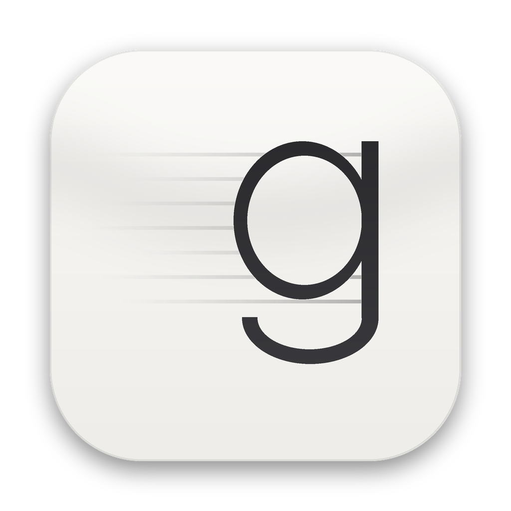
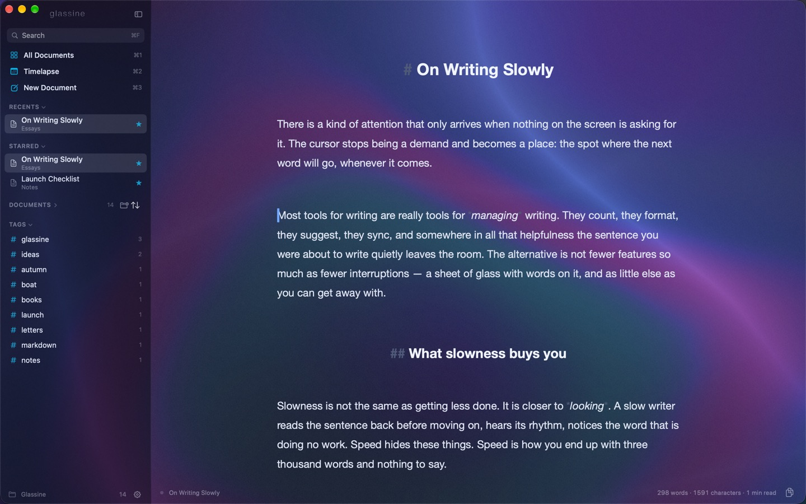
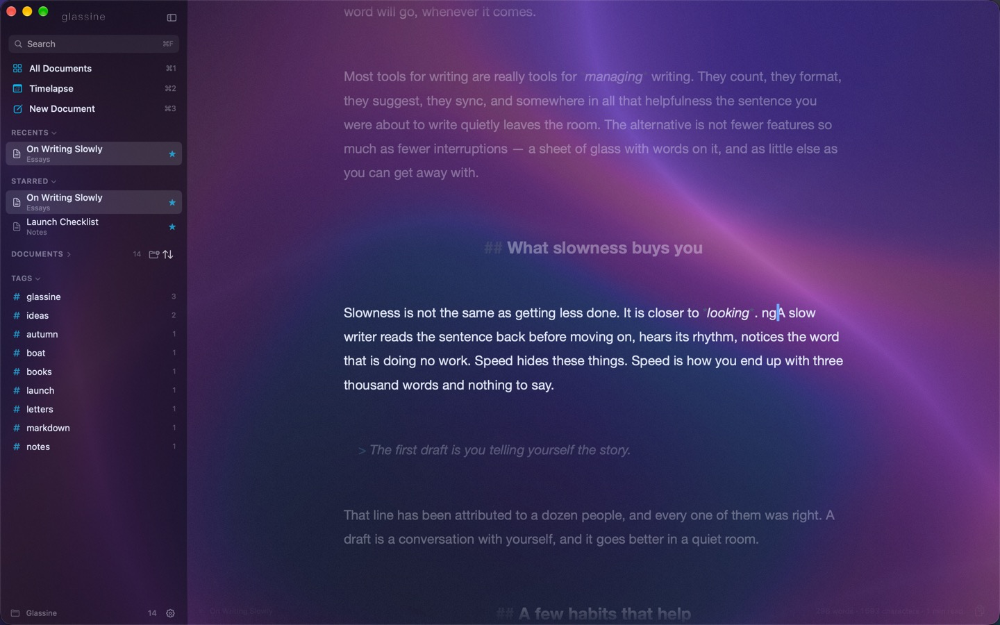
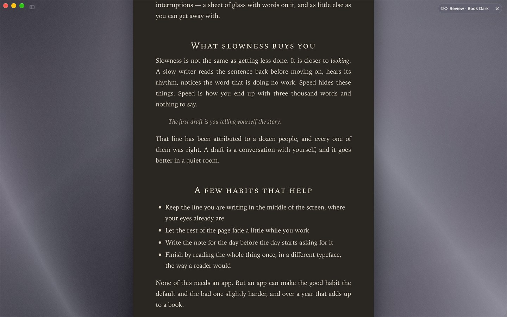
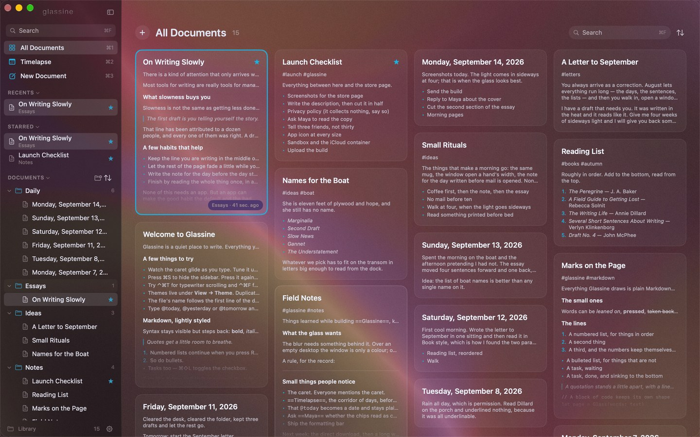
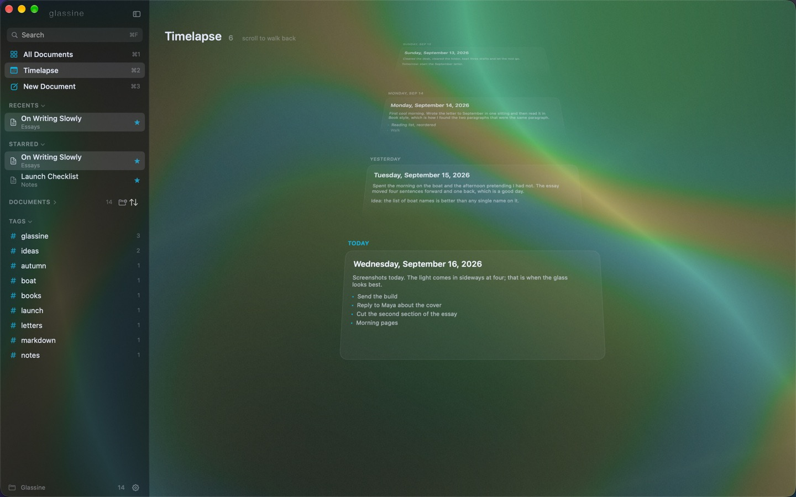
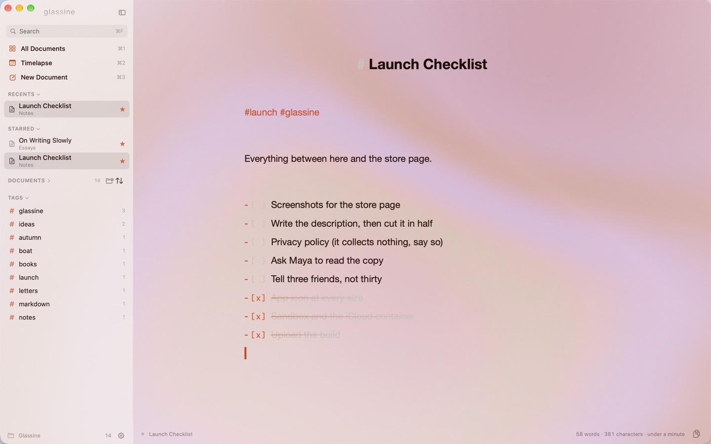

<p align="center">
  
</p>

<h1 align="center">Glassine</h1>

A quiet Markdown writing app for macOS. A translucent glass window, a caret that glides instead of jumps, a library that lives in iCloud Drive, autosave that never asks, and a Craft-style sidebar you can hide with one key.

Native Swift (SwiftUI + AppKit), no dependencies, no Xcode project — a Swift package and a build script. MIT licensed.



<table>
  <tr>
    <td></td>
    <td></td>
  </tr>
  <tr>
    <td></td>
    <td></td>
  </tr>
</table>

Focus mode and Review; All Documents and the Daily timeline.

There's a [45-second walkthrough](docs/demo.mp4) of the editor, Review mode and the All Documents mosaic as well.

*Glassine is the thin, translucent paper used to protect prints.*

## Install

Requirements: macOS 14 or later and Xcode (free, from the App Store). Then:

```bash
git clone https://github.com/a-libre/glassine.git
cd glassine
./build.sh --install    # compiles, copies Glassine.app to /Applications, opens it
```

Other options: `./build.sh` (build only, into `build/Glassine.app`), `./build.sh --run` (build and open without installing), `./build.sh --debug` (faster compile while hacking). To update later: `git pull && ./build.sh --install`.

The first launch asks for permission to access iCloud Drive. Say yes — that's where the library lives.

You can also open `Package.swift` in Xcode and press Run, which is handy for debugging; the assembled `.app` from `build.sh` is what you want for daily use (it has the icon and a stable identity for macOS permissions).

**Glassine Writer**, the same app built for the Mac App Store, was submitted for review on September 3, 2026; the link goes here when it is live. A notarized `.dmg` for direct download follows. Until then, building from source is the way to run it. Both routes are described in [RELEASING.md](RELEASING.md): `release.sh` makes the `.dmg`, `appstore.sh` the store package. `./build.sh --appstore` builds the store flavor locally: sandboxed, with its own iCloud folder instead of reading iCloud Drive directly.

## What it does

- **Glass.** The window is a blur of whatever is behind it, tinted by the theme. Seven built-in themes, dark by default; make your own in Settings with live preview, and export them as JSON.
- **Smooth caret.** The insertion point glides between positions instead of jumping. Speed, blink style and width are adjustable.
- **A library, not a file picker.** Documents live in `iCloud Drive/Glassine` as plain `.md` files and folders. New document is ⌘N; the file takes its name from the first line as you write.
- **Autosave** half a second after you stop typing, and at least every few seconds while you type.
- **Sidebar** with recents, starred, folders and tags, hidden and shown with ⌘S — and a Shelf at the bottom for what isn't current, out of the way without being archived.
- **All Documents** (⌘P): a mosaic of every document with rendered previews, navigable with the arrow keys.
- **Review** (⌘↩): the document rendered as HTML in one of five styles — Glass, GitHub, Book, Editorial, Mono.
- **Typewriter scrolling, focus mode, word count and reading time.**
- **Markdown, lightly styled.** Syntax stays visible but steps back: headings, emphasis, code, quotes, lists, tasks, links, tags.
- **Copy the whole document** as Markdown (⌘⇧C) or rich text (⌥⌘C).

## Where your writing lives

`~/Library/Mobile Documents/com~apple~CloudDocs/Glassine/` — that's the "Glassine" folder at the top level of iCloud Drive in Finder. Every document is a plain `.md` file, folders are folders. Anything you drop in there from Finder or another Mac shows up in the sidebar within a few seconds; anything Glassine writes syncs the usual iCloud way.

Change the location under Settings → General if you'd rather use a different folder (a Dropbox or Obsidian vault works fine).

The App Store build is sandboxed, so it cannot read iCloud Drive directly; it keeps its documents in an iCloud folder of its own, which Finder also shows as "Glassine" in iCloud Drive (with the app's icon). Pointing it at the folder above through Settings → General works too, and the permission is remembered.

## Saving

Always on. Glassine writes about half a second after you stop typing, at least every four seconds while you type continuously, when you switch documents, when the app loses focus, and on quit. The small dot at the bottom-left tells you what's happening: grey means clean, accent-colored means unsaved edits are pending, and a brief "Saved" with an iCloud check appears after each write. File → Save Now forces a write if you want the reassurance.

If a file changes on disk while it's open and you have no unsaved edits, Glassine reloads it. If both sides changed, your edits win and the other version is kept next to it as "… (conflict).md". Glassine compares file *contents* to decide this, not timestamps — iCloud rewrites modification dates after upload, and trusting them produced phantom conflict copies in the very first build. Any "(conflict)" files from that build are safe to delete.

## Naming

New documents start as "Untitled" and take their file name from the first line as you write (leading `#` and Markdown marks stripped). Rename a file yourself (⌘R or the sidebar's context menu) and Glassine stops touching its name. Turn the whole behavior off in Settings → General.

## Keyboard

| | |
|---|---|
| ⌘N / ⌘⇧N | New document / new folder |
| ⌘D | The Daily timeline — today in front, earlier days receding behind it |
| ⌥⌘D | Today's note (in a Daily folder, created on first use) |
| ⌘⇧E | Export the document as a PDF in the current Review style |
| ⌘/ | The shortcut sheet |
| ⌘K | The command bar — what makes sense where you are: Review styles in Review, sorting in the mosaic, modes in the editor |
| ⌘S (or ⌘\) | Show or hide the sidebar |
| ⌘P | All Documents — the mosaic view of the whole library |
| ⌘↩ | Review — the document rendered read-only in a chosen style (Esc or ⌘↩ leaves) |
| ⌘⇧C / ⌥⌘C | Copy the whole document as Markdown / as rich text |
| Esc | Zoom out one level: Review → editor → All Documents. Inside All Documents, Esc returns to the open document |
| ↑↓←→ and ↩ | In All Documents: move between cards and open the selected one (⌘↩ opens it in Review) |
| ⌃⌘T | Typewriter scrolling |
| ⌃⌘F | Focus mode (paragraph or sentence, pick in Settings). Scrolling lifts the dimming so you can read; the next click or keystroke brings it back where the caret lands |
| ⌘B ⌘I ⌘E ⌘⇧K | Bold, italic, inline code, link (wraps the selection in Markdown) |
| ⌘V over a selection | With a web address on the clipboard, links the selected words instead of replacing them |
| ⌘⌥1 ⌘⌥2 ⌘⌥3 ⌘⌥0 | Heading level / body text |
| ⌘⇧L | Toggle a task checkbox (or click the `[ ]`) |
| ⌘F | Search the library — titles, tags and full text |
| ⌘⇧F | Find in the open document (⌘G for next) |
| ⇥ / ⇧⇥ | Nest or un-nest a list item — bullets, numbers, and tasks; numbered items renumber to fit, and Return on an empty nested item steps back out |
| ⌘R | Rename |
| ⌘⇧⌫ | Shelve — out of the sidebar, Recents and All Documents, into the Shelf section at the bottom; Unshelve puts it back where it was |
| ⌘⌫ | Move to Trash (it goes to the macOS Trash, so it's recoverable) |
| — | Check a task (click its box in the editor or in Review) and, a moment later, it sinks below the last unfinished item in its list, nested items in tow; uncheck it and it rises back to where it was. Settings → Editor turns that off |
| — | Drag a task box or a list bullet or number up or down to reorder the list, nested items in tow |
| ⌘Z ⇧⌘Z | Undo and redo — typing first, then file operations: a new document, a rename, a move, a duplicate, a trash |
| ⌘+ ⌘− ⌘0 | Text size |
| ⌘, | Settings |
| ⌘⌥⇧D | Copy Debug Info (also in the Help menu) — caret geometry, layout and settings in one paste, for bug reports |

Help → Check for Updates… looks at GitHub Releases; the app also checks once a day unless you turn that off in Settings → General.

Return inside a list continues the list; Return on an empty item ends it.

## Caret

Settings → Caret. Smooth movement on or off, glide time (default 110 ms), whether to also glide while typing or only for arrow keys and clicks, blink style (soft fade, classic, or never) and width. The caret takes its color from the theme. If Reduce Motion is on in System Settings, gliding is disabled automatically.

## Themes

Seven built in: Ocean (default), Graphite, Sepia Night, Midnight, Moss, Frost and Paper. Pick one under View → Theme.

To make your own: Settings → Themes, select the one closest to what you want, press **+** to duplicate it, then edit. Everything is live in the main window while you tweak. A theme controls the glass material, the tint color and how strongly it covers the blur, an optional paper grain, and the colors for text, headings, accent, Markdown syntax, quotes, code, links, caret and selection. Themes export as small JSON files (the ••• menu), so they're easy to share or keep in a dotfiles repo.

Glass materials, roughly: *Soft glass* is the standard window blur, *Deep glass* is darker and blurrier, *Thin glass* lets more of the desktop through, *Frosted* is a light haze, and *Opaque* turns the blur off entirely.

## All Documents

The mosaic view (⌘P, the grid row at the top of the sidebar, Esc from the editor, or automatically when nothing is open) lays every document out as a card with its title and a small rendered preview, Craft-style. Cards are arranged shortest-column-first so the grid stays balanced; the current document gets a thin accent outline. The arrow keys move a selection between cards (left/right jump to the nearest card in the next column), Return opens the selected one and ⌘↩ opens it in Review. Search, tag filters and the sort order apply here too, and the right-click menu is the same as in the sidebar. The sidebar's own Documents tree starts collapsed for the same reason — this is the better way to browse — and remembers it if you open it.

## Review

⌘↩ swaps the editor for a read-only rendering of the document — real HTML in a web view, so tables, nested lists, task lists, code blocks and images all appear the way another Markdown app would show them. Five styles, under View → Review Style or the pill at the top-right: **Glass** (your theme's colors, transparent over the blur), **GitHub** (github.com's rendering, light or dark with the theme), **Book** (a cream page with drop caps and small-cap headings), **Editorial** (magazine typography: heavy headlines, pull-quotes) and **Mono** (a terminal). ⌘+ / ⌘− scale the text in Review independently of the editor. Links open in your browser. Esc or ⌘↩ returns to editing at roughly the same place.

## Copying a document

⌘⇧C copies the whole document as Markdown; ⌥⌘C copies it as rich text (RTF and HTML go on the clipboard, so Mail, Notes, Slack and Google Docs keep headings, bold, lists and links). The copy button at the bottom-right of the editor does Markdown on click, with rich text one click-and-hold away, and both are in the right-click menus in the sidebar and All Documents.

## Tasks

`- [ ] ` starts a task. Click the brackets to check it off: the line goes strikethrough and fades, and the file gets a `[x]` that any Markdown app understands. Click again to reopen it. ⌘⇧L does the same from the keyboard and turns an ordinary line into a task when there is no box yet. The checkboxes in Review are live too, and a click there writes the `[x]` straight into the file.

## Daily notes

⌘D (or the Today row in the sidebar) opens the Daily timeline: today's note lying readable at the front, earlier days receding up the corridor behind it — tilted back, smaller and fainter toward the vanishing point. Scroll to walk back through the days; click a card to open it. ⌥⌘D skips the corridor and opens today's note directly, titled with the date and kept in a `Daily` folder created on first use. Press it again tomorrow and you get tomorrow's.

## Headings

Headings are centered by default, in the editor and in Review alike; Settings → Editor turns that off (and switches off the larger heading sizes separately).

## Appearance

Settings → Themes can follow the system: pick one light theme and one dark theme and Glassine switches with macOS. Otherwise the chosen theme stays put.



## Dates

Type `@today`, `@yesterday` or `@tomorrow` followed by a space (or punctuation, or Return) and it becomes the actual date — `@September 1, 2026` in the file, drawn as a small capsule in the editor and in Review. Typing an ISO date like `@2026-09-01` gets the capsule too. Made for daily notes; the file stays plain text that any other app can read.

## Search

⌘F glides the search box from its spot in the mosaic header to the middle of the window and gives it the keyboard, with the mosaic filtering live behind it. Every word you type has to appear somewhere in a document's title, tags or text, ignoring case and accents; documents whose titles match are listed first. In the mosaic, the top result is selected as you type, so Return opens it, and the arrow keys walk the results. Esc clears the search.

## Tags

Write `#tag` anywhere in a document and it appears under Tags in the sidebar. Click a tag to filter the list. Hex colors like `#FFF` are ignored.

## Shelf

For documents that aren't current but aren't finished with either. Right-click one (or a folder) → Shelve, or ⌘⇧⌫ on the open document. It leaves Recents, Starred, the folder tree and All Documents, and appears in a Shelf section at the bottom of the sidebar, collapsed, with a count. Search still finds it. Unshelve puts it back exactly where it was.

On disk it's a plain move into a `Shelf` folder at the top of the library that mirrors the structure underneath (`Essays/Draft.md` becomes `Shelf/Essays/Draft.md`), so it syncs like everything else and nothing about the file changes but where it sits. Undo works on it like any other move.

## Project layout

```
Sources/Glassine/
  App/        GlassineApp (scenes, menus), AppState, Settings, Theme
  Library/    Library (iCloud folder scanning + file operations), Document (autosave, renaming)
  Editor/     GlassineTextView (smooth caret, layout, typewriter, focus), MarkdownStyler, StyleConfig, EditorView bridge
  UI/         ContentView, SidebarView, EditorContainerView, SettingsView, GlassBackground
  Support/    Distribution (sandbox / App Store differences), ScreenshotMode (the app photographs itself for the store), HexColor, small extensions
Resources/    Info.plist, icon (make_icon.py draws it), entitlements for each build flavor
docs/appstore/  the store listing, a showcase library, and the script that takes the screenshots
build.sh      assembles and signs Glassine.app (--appstore for the sandboxed flavor)
release.sh    notarized .dmg for direct download;  appstore.sh  signed .pkg for the Mac App Store
```

## Rebuilding after you change something

Edit anything under `Sources/Glassine/`, then `./build.sh --run`. Incremental builds take a few seconds. If a change misbehaves, Help → Copy Debug Info gives a snapshot of the editor's state that is easy to paste into a chat.

## Known limits (v1)

- One window. Glassine is a single-library app by design.
- Export is PDF only (File → Export as PDF…); the files are plain Markdown, so any converter works on them directly for other formats.
- Drag-and-drop between folders isn't wired up; use the context menu's "Move To".
- Tested on macOS 26/27 with Xcode 26. Minimum deployment target is macOS 14.

## Credits

Built by Alex Libre with Claude (Anthropic's Cowork) over an evening in September 2026, starting from a wish list of two things loved about [Paper](https://apps.apple.com/us/app/paper-writing-app-notes/id1143513744) — the glass and the caret — and a few things it lacked. The sidebar and mosaic take their cues from [Craft](https://www.craft.do). No code from either.
